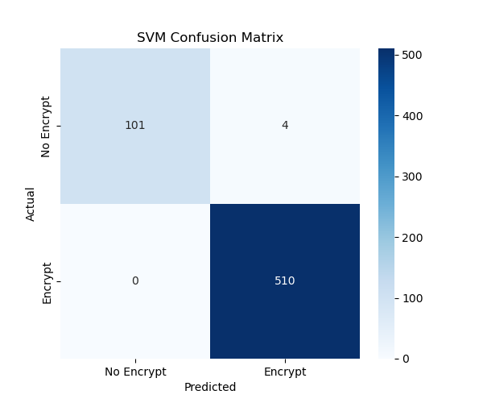
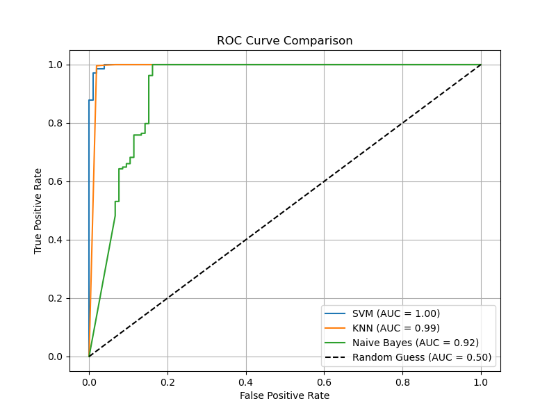

# A MACHINE LEARNING INFLUENCED CRYPTOGRAPHIC FRAMEWORK FOR FAST AND EFFICIENT ENCRYPTION

A complete end-to-end system that combines Machine Learning and chaotic cryptography to perform **selective image encryption and lossless decryption**.

---

## Overview

This project encrypts only the **important regions of an image** instead of the whole image.

* Image is divided into **8×8 blocks**
* Features are extracted using MATLAB
* An **SVM model** predicts which blocks to encrypt
* Multi-stage encryption is applied
* Full decryption reconstructs the original image

---

## Methodology

### 1. Feature Extraction

* Entropy
* Energy
* Correlation
* Contrast
* Homogeneity

### 2. Labeling

* High/Moderate entropy → Encrypt (1)
* Low entropy → Do not encrypt (0)

### 3. Model Training

* SVM (final model)
* KNN
* Naive Bayes

---

##  Encryption Stages

1. **XOR Diffusion (Selective Encryption)**

   * Applied only to blocks labeled as `1` by the ML model
   * Uses the **Henon_x key** from the `keys/` folder
   * Encrypted blocks are placed back in their original positions to reconstruct the intermediate image

2. **Pixel Permutation (Confusion)**

   * Applied to the entire image obtained from Stage 1
   * Uses the **Henon_y key** to perform pixel-level scrambling

3. **DNA-based Encryption**

   * Applied only to the **upper 4 bit-planes (MSB)**
   * Enhances security at the bit level using DNA encoding principles

---

## Decryption Stages

1. **DNA Decryption**

   * Reverses the DNA-based encryption applied in the final stage
   * Operates on the **upper 4 bit-planes (MSB)** to recover original bit patterns

2. **Inverse Pixel Permutation (Deconfusion)**

   * Reverses the scrambling applied during the confusion stage
   * Uses the same **Henon_y key** to restore the original pixel positions

3. **XOR Diffusion Reversal (Selective Decryption)**

   * Applied only to blocks labeled as `1`
   * Uses the same **Henon_x key**
   * XOR operation is reapplied to recover the original pixel values


---

## Results

### Confusion Matrix



### ROC Curve



---

## Pipeline Stages

Sample outputs for each stage are available in the `examples/` folder.

---

## Dataset Creation

The dataset is self-generated:

* Three images are divided into **8×8 blocks**
* Features are extracted using **MATLAB**
* Features from all three images are **combined into a single dataset and shuffled**
* Labels are assigned based on **entropy thresholds**
* The dataset is **normalized** before training the model

The extracted feature datasets for the three images are available in the `data/` folder.

---

## Project Structure

```
ML-Selective-Image-Encryption/
 ├── src/
 ├── data/
 ├── results/
 ├── examples/
 ├── notebooks/
 ├── matlab/
 ├── keys/
 ├── README.md
```

---

## How to Run

```bash
python src/pipeline.py
```

---

## Technologies Used

* Python
* MATLAB
* OpenCV
* Scikit-learn
* NumPy, Pandas

---

## Publication

This work has been published in the **IOP Conference Series**.

🔗 DOI: 10.1088/1742-6596/3191/1/012095

The publication presents the proposed selective encryption and decryption framework along with experimental results.

---

##  Author
Sandeep Das Yadav P.
B.Tech Electronics and Communication Engineering
